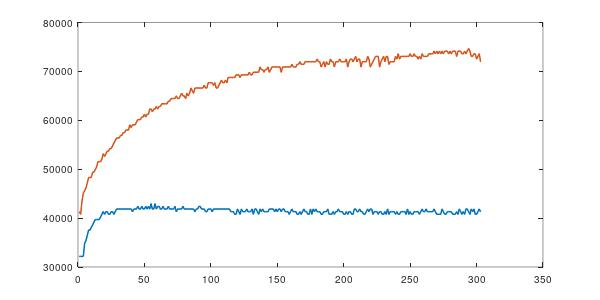

CPU Fan for the Raspberry Pi 3 b
-------------------------------
Implements the PID algorithm to control the CPU fan on a Raspberry Pi3 b. There are two main parts to this repo, one is the kernel module for the actual control of the fan(fan_control.ko) and the other is a userspace utility that finds the proportional constant(tune).
The kernel module implements the following algorithm.

Interfacing the fan to the board
--------------------------------
Raspberry pi series of SBCs come with power pins(5V) on pins 2 and 4. Ground is on pin 6 . PWM is available on pin 12 (GPIO18). 
The fan chosen is the Noctua NF-A4x10 5 volt pwm fan mainly because of its form factor and it is controllable via PWM.

Running the software.
---------------------
Extract the code from github.
- Follow the instructions at https://www.raspberrypi.org/documentation/linux/kernel/building.md and build and test the kernel.
- copy the file pwm-overlay.dts to arch/arm/boot/dts/overlays and re-build the kernel
- run the make command in the kernel and uspace directories.  
- cd to the uspace directory and run the tune command. That will give you the proportional constant.
- cd to the kernel directory and insert the kernel module with the following command.  
*sudo insmod fan_control.ko set_point=30000 prop_constant=650*  
set_point is the desired temperature of the cpu in millicentigrade and prop_constant is the proportional constant as reported by the tune utility.  
  
*The blue line is with the kernel module inserted. The orange line is without the kernel module. 'stress -c 4' was used to exercise the cpu.*

Notes
-----
The tune utility will run the fan at half of maximum speed for 60 seconds and calculate the proportional constant from the temperature differences from before and after. In tests, we have noted a temperature decrease of upto 20 degrees centigrade or more under load. Raspberry Pi 3b uses pwm for its audio. Onboard audio is unusable while the driver is active. HDMI audio is unaffected.
